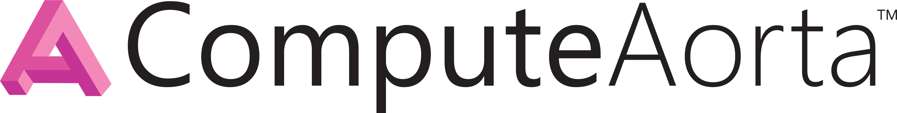

----

Welcome to ComputeAorta's documentation!
########################################

The documentation herein refers to version |release| of ComputeAorta.

The heterogeneous language toolkit.
===================================

ComputeAorta is a framework to provide implementations of open standards, such
as OpenCL and Vulkan, for a wide range of devices. For more information about
building, implementing and maintaining ComputeAorta please take the time to read
this documentation.

.. toctree::
    :maxdepth: 3

    overview
    getting-started
    specifications
    developer-guide
    tutorials
    design
    source/cl
    source/vk
    modules
    external-testing-ecosystem
    api-reference
    cmake
    scripts
